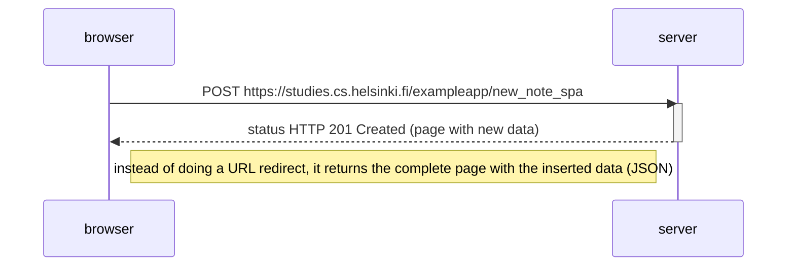

## Mermaid Code

```
sequenceDiagram
    participant browser
    participant server

    browser->>server: POST https://studies.cs.helsinki.fi/exampleapp/new_note_spa
    activate server
    server-->>browser: status HTTP 201 Created (page with new data)
    deactivate server

    Note right of browser: instead of doing a URL redirect, it returns the complete page with the inserted data (JSON)
```

## Result

